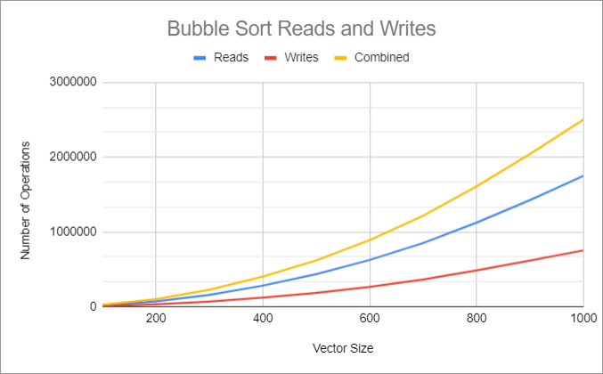
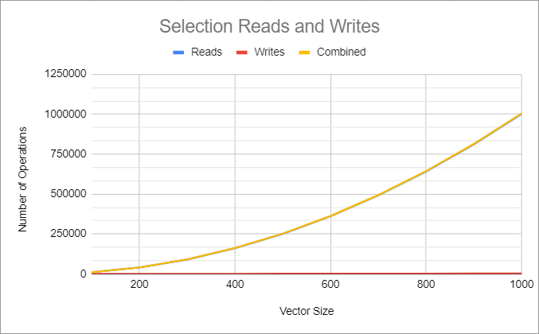
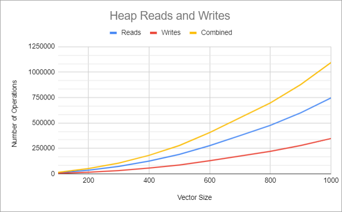
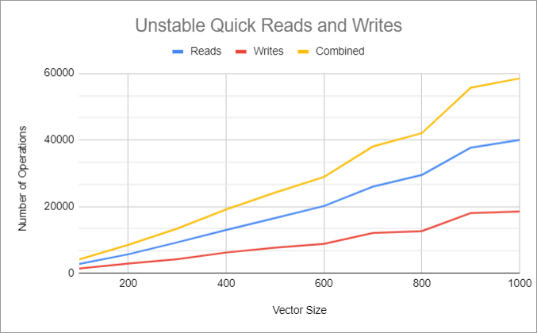
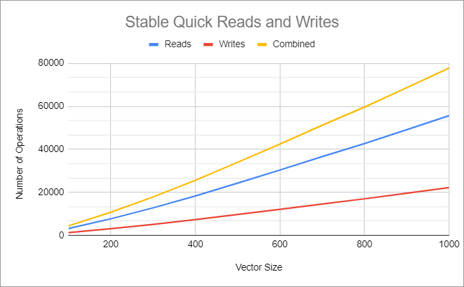
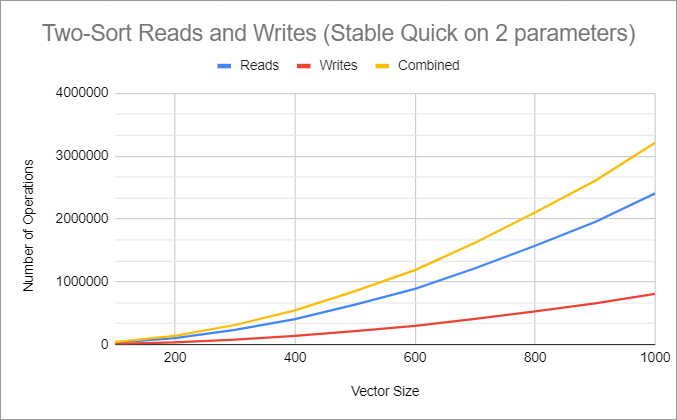

# CS 120 Module 3 Applied Project (adapted from uvmcs124f2022/Project4-sstclair)

For this project, you will sort the 1000 objects from your data set. You will modify each sorting algorithm to collect
data. You will analyze the results from the different sorting algorithms.

## Implement

You should have your 1000+ objects stored in a vector, initially unsorted.
Use these five sorting algorithms:

1. Bubble Sort
2. Selection Sort or Insertion Sort
3. Merge Sort or Quick Sort
4. Heap Sort
5. Two-sort: sort by any algorithm (except Bubble Sort), then sort on a different field using a stable sorting
   algorithm (again, except Bubble Sort).
    * Hint for implementing two-sort: for the second stable algorithm, make a copy of the stable sorting function and
      take out the template part. That way you will be able to call a getter on your custom-type objects to compare a
      second field of your class.

Modify each sorting algorithm to record the number of reads. This is the number of times you use a Comparable object.
This could be using it to store somewhere else, using it to compare to another object, etc. Temporary Comparable objects
count towards the reads.

* Example code:
  ```cpp
  if (vec[i] > vec[i+1]) // This counts as two reads, which should
      // be counted whether the if statements evaluates to true or false.
  Comparable temp = vec[i]; // This is one read.
  smaller.push_back(vec[i]); // This is one read.
  ```

Modify each sorting algorithm to record the number of writes. This is the number of times you assign into a Comparable
object. This could be to store a temporary Comparable, to overwrite an item in a Comparable vector, to push_back onto a
Comparable vector, etc.

* Example code:
  ```cpp
  Comparable temp = vec[i]; // This is one write (and one read).
  smaller.push_back(vec[i]); // This is one write (and one read).
  vec[i] = vec[i+1]; // This is one write (and one read).
  ```

Use a loop to record the number of reads and writes needed to sort a vector of size 100, 200, 300, 400, 500, 600, 700,
800, 900, and 1000.

* Hint: start with 1000 and then use the resize method to make it smaller.

Keep all output in the console (and not files). Each of the five sorting algorithms should be given identical unsorted
vectors to begin with.

* If your data is already sorted by the attribute you use to overload your operators, change how you overload your
  operators.

## Extra Credit

To earn up to 10 extra credit points (at the grader’s discretion), you can get more thorough results. This can include,
but is not limited to:

* Setting timers to record how long it takes you to sort the objects with each algorithm.
* Performing the same experiment, except double the size of the data set each time (instead of having it grow linearly).
* Using more sorting algorithms.

Note that if you add this logic to your code but do not analyze it in your report, it will not count towards extra
credit. If you complete extra credit, analyze it in this section of your README.md file.

## Project 4 Report

Sean St. Clair

Professor Lisa Dion

CS124

9 December 2022

### You will have a different grader again, so make sure your report includes information about your dataset.

This data set represents a list of 1,250 magical trinkets and their various properties. The
“owner” field (a string) represents the name of the mythical adventurer that owns the trinket. The
“modifier” field (an integer) represents a value associated with a magical item’s power - a
concept present in many fantasy games such as Dungeons and Dragons. The “adjective” field (a
string) represents a defining adjective of the trinket, as in “flaming” sword, or “magical” staff.
The “type” field (a string) represents what type of object the trinket is - a sword, tome, necklace,
or wedge of cheese, for example. The “attribute” field (a string) represents the trinket’s special
attribute, as in a sword “of holiness” or a tome “of Exclusiveness.” This property is again often
found in fantasy settings, where a magical item may possess more than one defining special trait.
Finally, the “value” field (an integer) represents how many gold pieces a given trinket is worth.

### Analyze the data. Graph the number of reads and writes for each sorting algorithm and look at how the number of reads and writes grows when the size of the data set grows.








### Compare and contrast the different sorting algorithms and draw conclusions about which sorting algorithms are more efficient. Discuss complexities and their effects.

I have graphed the number of reads and writes for each algorithm, as well as the combination of the two operations. I
believe this combination figure gives me a reasonable approximation of the overall time complexity of each algorithm, as
these read and write operations are mostly representative of how each sorting algorithm actually manipulates the vector
it is given.

Bubble - For the bubble sort, the expected time complexity is O(n^2). In other words, we would expect to see the time
complexity increase with respect to the number of inputs, n, squared (times some coefficient). This can be seen in the
graph of bubble sort, where the combined reads and writes do indeed seem to follow a quadratic curve. This appears to be
our slowest individual sorting algorithm of the ones tested.

Selection - The selection sort also has an expected time complexity of O(n^2). This can be seen in the graph, which
bears a very similar curve to that of the Bubble sort graph. One will note that the selection sort appears to have fewer
reads / writes overall when compared to Bubble sort, but these two algorithms are still in the same complexity class
regardless of any differences they may have in the coefficient of that complexity. Selection also appears to do almost
all of its sorting logic within its comparisons, with the reads comprising most of the combined reads+writes figure, and
with writes being almost negligible.

Heap - The Heap graph also showcases its expected time complexity behavior, O(n * log(n)). While the reads and writes on
an absolute scale seem comparable to that of selection sort, due to the nature of the time complexity, we would expect
Heap to be more efficient as the size were to increase further.

Unstable Quick - The quick sort algorithm also has an average time complexity of (n * log(n)), with a quadratic
complexity in its worst case. In this case, we can see that the sort was performed with far fewer reads / writes than
other algorithms. The curve is expectedly more drastic than a linear relationship, but still far less so than a
quadratic or greater relationship between the number of operations and vector size, n.

Stable Quick - The stable quick sort algorithm only makes small modifications to the unstable quick sort, which is why
both exhibit the same growth pattern (with the same average time complexity, (n* log(n)), with worst-case O(n^2)). We
can observe slightly higher reads / writes as a result of a slightly greater coefficient for this complexity, as there
may have been a few more reads / writes in the code in order to preserve stability.

Two-sort - My two sort implementation simply uses the stable quick sort algorithm twice in succession on my vector,
each time using a different parameter to sort items. The growth rate thus still resembles that of the previous curves,
though this time with a significantly greater coefficient, due to the additive nature of reads + writes when two sorts
are performed in succession.

### Answers to the following questions:

* If you need to sort a contacts list on a mobile app, which sorting algorithm(s) would you use and why?

  If I were to sort a contact list on a mobile app, I would use the stable quick sort algorithm. For one, I would pick a
  stable algorithm, as I would want to have the power to sort contacts by other attributes after sorting them by their
  name (even with name-sorting, we can imagine sorting by their first and last names, which would already necessitate a
  stable sorting algorithm). I will also want to choose an algorithm of a relatively low time complexity, for the sake
  of speed. Of the stable algorithms we have tested here, it is clear the quick sort is the one with the fewest
  reads and writes for relatively few entries, which is important from both a time and space perspective on a mobile
  device. I am wary of excess reads and writes, because to me that implies the possibility of far greater temporary
  memory usage, which is definitely a consideration on a mobile device.

* What about if you need to sort a database of 20 million client files that are stored in a datacenter in the cloud?

  With so many entries, space and time complexity becomes even more of a worry, with less consideration for the
  performance of the algorithms at very low entry sizes. Because we are imaginably working with a far more powerful
  system than a mobile device, we can disregard a lot of the initial overhead that might give one algorithm a slight
  edge over another, investing fully into optimizing space and time complexity. If we knew that the data type was
  applicable (number fields), we might use a count sort like radix sort in order to sort these entries in very good
  time (even smaller than n * log(n)), and with a very good space complexity (constant) after some initial overhead.
  However, with client files I cannot guarantee this sort will be applicable, so I would use the heap quick sort both
  for its reasonable time complexity (n * log(n)) and impressive space complexity (constant). While heap appears to be
  slightly slower than quick sort in my tests, both are in the same average time complexity class, with heap sort
  actually coming ahead in the worst case. Quick sort also has a linear space complexity, which is very good, but
  incomparable to heap's constant space complexity.

### Extra Credit Analysis:

* Setting timers to record how long it takes you to sort the objects with each algorithm.

  I set timers to record the elapsed time of each sorting algorithm (the code I used to do this can be found in the "
  additional notes" section at the end of this report)! These are the elapsed time values from my console output for the
  vectors of size 1000, compared with the elapsed time values for vectors of size 100:

  1000 bubble elapsed time = 58598600ns

  1000 selection elapsed time = 16740000ns

  1000 quick unstable elapsed time = 3331500ns

  1000 heap elapsed time = 18261100ns

  1000 first stable quick sort elapsed time = 8366100ns

  100 bubble elapsed time = 815800ns

  100 selection elapsed time = 242300ns

  100 quick unstable elapsed time = 156000ns

  100 heap elapsed time = 282700ns

  100 first stable quick sort elapsed time = 497000ns

  It is interesting to observe how much time the algorithms took on the smallest vector size. Bubble sort performs in
  under 1 million nanoseconds, stable quick sort takes about half as long, selection and heap sort are even quicker,
  with unstable quick taking the lead as the fastest sort at this size. At this size, the time complexities of each
  algorithm may be disproportionately affected by initialization costs, and disparities between complexity trends may
  not be as evident.

  However, when we look at the largest vector size of 1000, we can gain a better understanding of these time
  complexities as n increases. For example, Bubble sort's relatively inefficient time complexity has really caught up to
  it; where once it only took about twice as long as the stable quick sort, it now takes over 58 million nanoseconds,
  which is closer to 7 times as long as quick sort's 8.4 million nanoseconds. And while quick sort still takes the lead
  over heap sort at this size, we can see that heap sort's growth rate is still far more reasonable than something like
  bubble sort, due to their differing time complexities.

  From these cursory tests, it also appears that my time complexity findings were consistent with my expectations from
  my read + write graphs. Bubble seems to exhibit the worst time behavior, with unstable and stable quick sorts being
  the fastest.

* Using more sorting algorithms.

  I used both the unstable and stable quick sort algorithms in order to compare their relative efficiencies. From my
  previous graph analysis, it is clear that these two algorithms are incredibly comparable, with very similar read +
  write curves. However, the stable quick sort algorithm appeared to be slightly slower at these vector sizes, which is
  likely the result of the greater number of reads + writes required to keep the sort stable. We can see that at the
  largest vector size tested, this difference was quite appreciable in terms of time, with the stable algorithm taking
  over twice as long as its unstable counterpart.

## ADDITIONAL NOTES:

* Any code that was not authored by yourself or the instructor must be cited in your report. This includes the use of
  concepts not taught in lecture.

  I used https://stackoverflow.com/questions/2808398/easily-measure-elapsed-time for my timer.

  I also used this site for a refresher on algorithm
  complexities: https://www.geeksforgeeks.org/time-complexities-of-all-sorting-algorithms/

## Submit

You must include your source (all .cpp and .h) files, your data (.csv) file(s), CMakeLists.txt, and your updated
README.md file that contains your report to your repository. Submit to Gradescope using the GitHub repository link,
double-check that all the correct files are there, and wait for the autograder to provide feedback.

## Grading

The project is out of 90 points.

| Points Possible | Description of requirement |
|------------------- | ----------------------------- |
| 5 pts | Program compiles and runs. |
| 5 pts | Code style. Readable, naming style is consistent, comments where appropriate. |
| 5 pts | Use five sorting algorithms according to the directions above. |
| 15 pts | Sort the 100, 200, … 1000 objects according to the directions above. |
| 40 pts | Record the correct number of reads and writes for each sort. |
| 20 pts | Report: content, formatting, professional, grammatically correct, cites sources. |